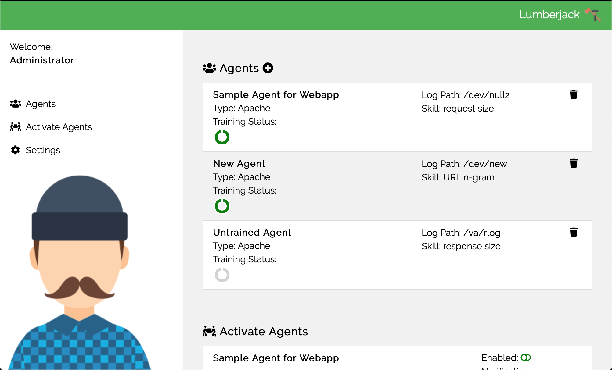

# Lumberjack
This is a UEBA (User/Entity Behavior Analysis) tool reference implementation
to show a proof-of-concept that implements analysis strategies identified
in [previous experimentation](https://github.com/robertwatkins/playground-robert/blob/master/Python/Jupyter/apache/ApacheNGram-Experiment2.ipynb). 

Once the utility is configured and agents are enabled, notifications will be
generated when suspicious be behavior is detected.

NOTE:Much of the description on this site is aspirational and does not reflect current functionality.

### Components
**Admin Console**

The admin console allows security users to identify the location of log files to analyze as well as what kinds of analysis to perform.

Once that configuration is in place, a 'Notification Channel' is selected and the agent can be enabled to start anlyzing the logs.

**Training Daemon**

This process will look for agent training tasks to perform to build out the machine learning skills specified in the configuration.

**Agent Daemon**

Once trained and enabled, the agent will process new log entries looking for anomalous behavior. Suspicious behavior will be logged using the configured notificaiton channel (Slack, Jira, SEIM tool, etc.)

### System Architecture

### Installation
For now this will need to be installed manually all on the same system. 

WARNING: I haven't verified that these are complete and accurate. However, they do describe essential steps.

**Pre-requisites**
 - http server (Apache, NodeJS, etc.) on port 80
    - Copy all client files and subfolders to the root of your http server.
 - Python 3 libraries
    - pip install flask flask-jsonify flask-sqlalchemy flask-restful flask-cache
 - sqlite db
    - sqlite3 lumberjack.db < ../data/db.sql

### Startup

 - Start http server
 - Start rest service (http://localhost:8888)
 
        cd <install directory for 'server' folder>
        python server.py
 - Start trainer daemon
 
        cd <install directory for 'daemon' folder>
        ./trainer.py start
        (Note: './trainer.py stop' will stop the service)
 - Start runner daemon
 
        cd <install directory for 'daemon' folder>
        ./runner.py start
        (Note: './runner.py stop' will stop the service)
 - Launch your browser to your web server
 