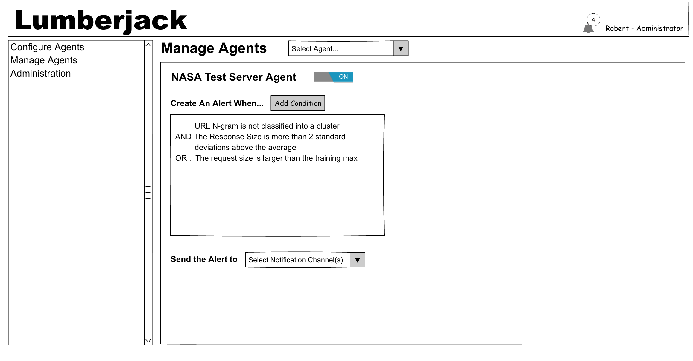
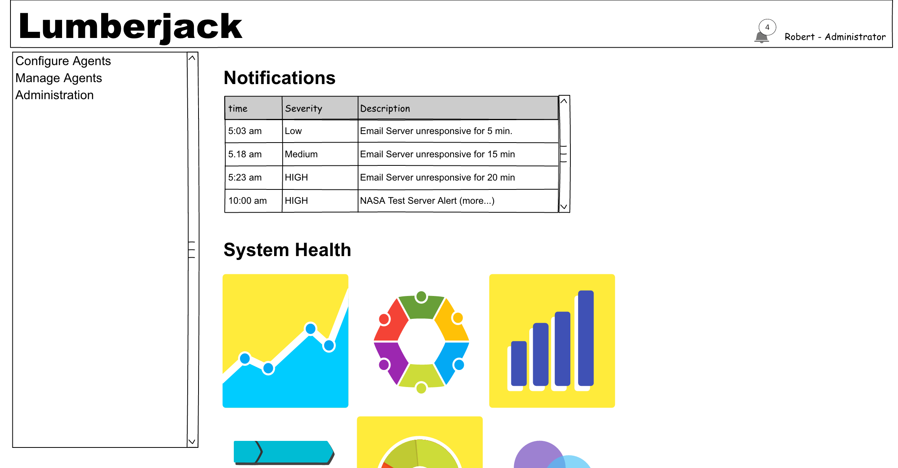

# Lumberjack
This is a UEBA (User/Entity Behavior Analysis) tool reference implementation
to show a proof-of-concept that implements analysis strategies identified
in [previous experimentation](https://github.com/robertwatkins/playground-robert/blob/master/Python/Jupyter/apache/ApacheNGram-Experiment2.ipynb). 

Once the utility is configured and agents are enabled, notifications will be
generated when suspicious be behavior is detected.

### Configure Agents
Configuring agents consists of two essential tasks:
 - Identify training and testing logs (this could likely be simplified by only
 referencing the source log location)
 - Enabling specific skills for the logs.
 
 The skills needed to configure agents is someone with strong Data Analysis 
abilities to understand the suitability and usefulness of the results of
using that skill. Segregating this functionality from the administration
should aid in promoting separation of duties.
 
 NOTE: All the logs for a particular agent should have consistent formatting.
 
 **Skills**
 
 Depending on the type of log file being analyzed as well as the specific
 aspects of the log being analyzed, different skills can be applied.
 
 New skills can be added over time as needs change and as new skills are 
 available.

### Administration
**Users**

This will only be for demo purposes and not be linked to actual user permissions

**Notification Channels**

Whether you are getting notified through text, Slack or some other mechanism,
this is the screen where that configuration is managed. It's also useful to
consider setting up notifications by team or application, depending on what
is most convenient for your use.

### Manage Agents
Agents are connected to notification channels and can be enabled and disabled.

The _Conditions_ section will not be implemented in this 

### Home Page
This page is for demonstration purposes and will not be implemented as part of
the proof of concept.

### Out of Scope items
While these items would be useful for a final product, they are not included in
this proof-of-concept.

**Screenshot Items that are out of scope**
- Home Page 
  - Notifications
  - System Health
- Administration
  - User Administration
- Manage Agents
  - Condition configuration  

**Other Items that are out of scope**
 - Audit logging (user management, agent configuration and management, etc.)
 - Plugin support 
   - New log formats
   - New skills
   - Notification targets (email, text, Veracode, OSSIM, 
SEIMonster, Jira, etc.)
 - OAUTH 2.0 support
 - Since training is a lengthy process, estimated time to completion will not
 be included
 