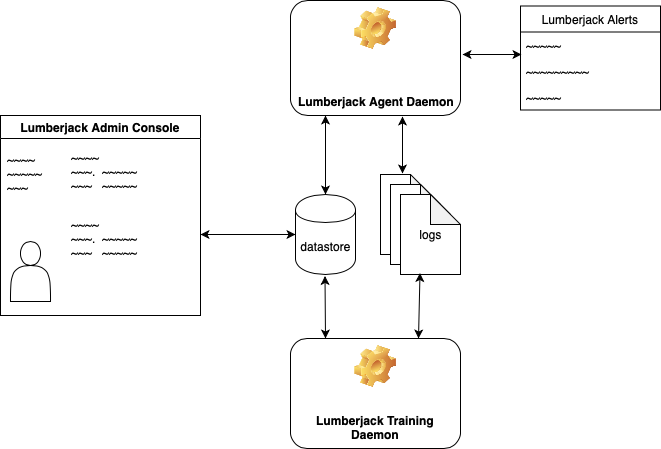

# Lumberjack
This is a UEBA (User/Entity Behavior Analysis) tool reference implementation
to show a proof-of-concept that implements analysis strategies identified
in [previous experimentation](https://github.com/robertwatkins/playground-robert/blob/master/Python/Jupyter/apache/ApacheNGram-Experiment2.ipynb). 

Once the utility is configured and agents are enabled, notifications will be
generated when suspicious be behavior is detected.

### Components
**Admin Console**

The admin console allows security users to identify the location of log files to analyze as well as what kinds of analysis to perform.

Once that configuration is in place, a 'Notification Channel' is selected and the agent can be enabled to start anlyzing the logs.

**Training Daemon**

This process will look for agent training tasks to perform to build out the machine learning skills specified in the configuration.

**Agent Daemon**

Once trained and enabled, the agent will process new log entries looking for anomalous behavior. Suspicious behavior will be logged using the configured notificaiton channel (Slack, Jira, SEIM tool, etc.)

### System Architecture
